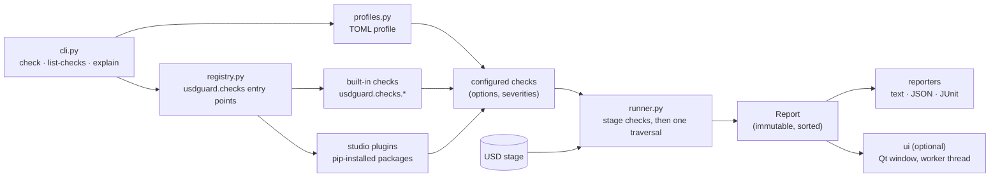
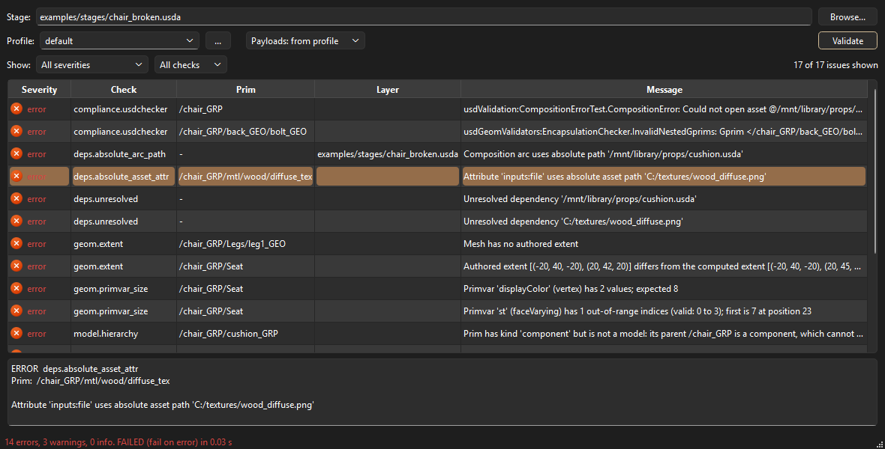

# usdguard

[](https://github.com/JsonDoe/usdlint/actions/workflows/ci.yml)
[](pyproject.toml)
[](https://pypi.org/project/usdguard/)
[](pyproject.toml)
[](LICENSE)

usdguard validates USD stages against studio policy: naming, metadata,
dependencies, material bindings, model hierarchy and geometry
integrity. It is DCC-agnostic, needs nothing but `usd-core`, and gives
you three ways in:

- a Python API;
- a CLI with CI-friendly exit codes;
- text, JSON and JUnit reports.

Checks are plugins discovered through Python entry points, and the
built-in checks are registered exactly the same way. A studio adds its
own rules by installing a package; it never needs to fork usdguard.

> **Status:** pre-release. Version 0.1 is feature-complete and tested on
> Linux and Windows with Python 3.10 to 3.14. It is not on PyPI yet;
> install it from a clone (see [CONTRIBUTING.md](CONTRIBUTING.md)).

## Quickstart

```sh
pip install usdguard
usdguard check "assets/**/*.usda"
usdguard check assets/chair/chair.usda --format json -o report.json
```

The default text report groups issues by stage, with aligned columns:

```text
examples/stages/chair_broken.usda
  error    geom.extent        /chair_GRP/Seat         Authored extent [(-20, 40, -20), (20, 42, 20)] differs from the computed extent [(-20, 40, -20), (20, 45, 20)]
  error    geom.primvar_size  /chair_GRP/Seat         Primvar 'displayColor' (vertex) has 2 values; expected 8
  error    model.hierarchy    /chair_GRP/cushion_GRP  Prim has kind 'component' but is not a model: its parent /chair_GRP is a component, which cannot contain models
  error    stage.metadata     -                       upAxis is not authored; expected 'Y'
  warning  naming.prim_name   /chair_GRP/Seat         Mesh name 'Seat' does not match '^[a-z][a-zA-Z0-9]*_GEO$'
  ...

1 stage checked: 14 errors, 3 warnings, 0 info. FAILED (fail on error)
```

Other commands:

- `usdguard list-checks` shows every installed check.
- `usdguard explain <check_id>` prints a check's rationale, options and
  a failing example.
- [`examples/stages`](examples/stages) holds clean and broken assets to
  try it on.

## Architecture



| Module | Responsibility |
|---|---|
| `core.py` | `Severity`, `Issue`, `Context`, `Report`, and the `Check`, `StageCheck` and `PrimCheck` base classes. |
| `runner.py` | Opens stages with a payload policy and runs the checks with crash isolation. |
| `registry.py` | Lazy, cached discovery of checks registered as entry points, with duplicate detection. |
| `profiles.py` | Finds, parses and validates TOML profiles, then instantiates the checks they enable. |
| `reporters/` | Text, JSON (versioned schema) and JUnit XML output. |
| `cli.py` | The `usdguard` command. |
| `ui/` | Optional Qt window (`usdguard-ui`): a table model over the report, a filter proxy, and a worker thread. |

## Desktop UI (optional)



```sh
pip install "usdguard[ui]"
usdguard-ui examples/stages/chair_broken.usda
```

The window does the following:

- **Choose what to validate.** Pick a stage with *Browse* or drop a
  `.usd*` file on the window. Choose the profile: a built-in name, a
  name found in `USDGUARD_PROFILE_PATH`, or a TOML file. Choose the
  payload policy, then press *Validate* (F5).
- **Explore the issues.** Narrow the table to a severity or a check,
  and sort any column (severities sort by seriousness). Select a row to
  see the whole issue below the table, or right-click it to copy its
  prim path or message.
- **Validate in the background.** A worker `QObject` in a `QThread`
  opens its own stage, so the window stays responsive. Only the
  immutable `Report` comes back to the UI thread; no USD object crosses
  threads.

The UI uses the [Qt.py](https://github.com/mottosso/Qt.py) shim and is
tested with both PySide6 and PySide2. Inside a DCC that already ships a
Qt binding, install `usdguard` and `Qt.py` without the extra; the UI
then uses the host's binding.

## Check catalog

| check_id | Kind | Reports | Options (default) |
|---|---|---|---|
| `naming.prim_name` | prim | Prim names that do not fully match the regular expression for their type. | `rules` (none) |
| `stage.metadata` | stage | Missing or unexpected `upAxis` and `metersPerUnit`, and a missing or dangling `defaultPrim`. | `up_axis` (`"Y"`), `meters_per_unit` (`0.01`), `require_default_prim` (`true`) |
| `deps.absolute_arc_path` | stage | Absolute sublayer, reference and payload paths in used layers. POSIX and Windows paths are caught on any OS. | — |
| `deps.absolute_asset_attr` | prim | Absolute paths in asset and asset-array attributes, at the default time and in every time sample. | — |
| `deps.unresolved` | stage | Dependencies of the root layer that do not resolve, across all variants, including textures. | — |
| `shading.material_binding` | stage | Default- or render-purpose gprims without a bound material. Resolved in one batched call, including instance proxies. | — |
| `model.hierarchy` | prim | Prims with a model kind that USD does not treat as models (a component inside a component, or a gap in the group chain), with the reason. | — |
| `geom.primvar_size` | prim | Mesh primvars whose size does not match their interpolation times `elementSize`; bad index counts and out-of-range indices. | — |
| `geom.extent` | prim | Boundables with a missing extent, or one that differs from the computed extent. | `tolerance` (`1e-4`), `sample_times` (`"default"` or `"all"`) |
| `compliance.usdchecker` | stage | Errors and warnings from OpenUSD's own validators, the ones `usdchecker` runs. | `keywords` (all), `exclude` (none) |

Every check defaults to the ERROR severity; profiles change it.
`usdguard explain <check_id>` shows the full documentation.

## Profiles

A profile chooses the checks, their options, their severities, and
when a run fails:

```toml
fail_on = "error"           # info | warning | error
load = "all"                # payloads: "all" or "none"
checks = ["stage.metadata", "naming.prim_name", "geom.extent"]

[severity]
"naming.prim_name" = "warning"

[options."stage.metadata"]
up_axis = "Y"
meters_per_unit = 0.01

[options."naming.prim_name".rules]
Mesh = '^[a-z][a-zA-Z0-9]*_GEO$'
Xform = '^[a-z][a-zA-Z0-9]*_GRP$'
```

- **Write regular expressions as single-quoted TOML literal strings.**
  In double-quoted strings, TOML treats backslashes as escapes, so
  `"\d"` is an error and `"\\d"` is needed instead.
- **How `--profile` finds a profile.**
  1. A path to an existing file is used as-is.
  2. Otherwise, `<name>.toml` is looked up in each directory of
     `USDGUARD_PROFILE_PATH` (separated by `:` on Linux, `;` on
     Windows); the first match wins.
  3. Last come the built-in profiles. The built-in
     [`default`](src/usdguard/profiles/default.toml) profile enables
     every built-in check.
- **Without `checks`,** every installed check runs.
- **Severity overrides** replace a check's default severity. Issues a
  check reports with an explicit severity keep it, such as the INFO
  note for in-memory stages or a validator warning.
- **Mistakes exit with code 2 and an actionable message.** These
  include an unknown check, an unknown or invalid option, an invalid
  severity, a broken regex, and a missing file. The message names the
  problem, suggests close matches for check ids, and lists the valid
  options.

[`examples/profiles/lenient.toml`](examples/profiles/lenient.toml) is a
commented example.

## Writing a custom check

A plugin is an ordinary Python package that registers its checks in the
`usdguard.checks` entry-point group. The complete example lives in
[`examples/custom_check_plugin`](examples/custom_check_plugin), and CI
installs and tests it.

`pyproject.toml`: the entry point name must equal the `check_id`.

```toml
[project]
name = "usdguard-example-plugin"
version = "0.1.0"
dependencies = ["usdguard"]

[project.entry-points."usdguard.checks"]
"example.no_empty_groups" = "usdguard_example_plugin.checks:NoEmptyGroupsCheck"
```

`src/usdguard_example_plugin/checks.py`: subclass `PrimCheck` (called
for every prim) or `StageCheck` (called once). Constructor keyword
arguments are the options a profile can set. The docstring is what
`usdguard explain` prints.

```python
from usdguard import Context, Issue, PrimCheck, Severity


class NoEmptyGroupsCheck(PrimCheck):
    """Grouping prims must not be empty.

    Options:
        types: Prim type names treated as groups.

    Example:
        def Xform "old_geo" {}
    """

    check_id = "example.no_empty_groups"
    description = "Xform and Scope prims have at least one child."
    severity = Severity.WARNING

    def __init__(self, *, types=("Xform", "Scope")):
        self.types = frozenset(types)

    def applies_to(self, prim):
        return str(prim.GetTypeName()) in self.types

    def check_prim(self, prim, context: Context):
        if not prim.GetChildren():
            yield self.issue(f"{prim.GetTypeName()} has no children", prim)
```

`tests/test_no_empty_groups.py`: build a stage in memory and run the
check through the real runner.

```python
from pxr import Usd, UsdGeom
from usdguard import run
from usdguard_example_plugin.checks import NoEmptyGroupsCheck


def test_empty_groups_are_reported():
    stage = Usd.Stage.CreateInMemory()
    UsdGeom.Xform.Define(stage, "/chair")
    UsdGeom.Mesh.Define(stage, "/chair/seat")
    UsdGeom.Xform.Define(stage, "/chair/old_geo")

    report = run(stage, [NoEmptyGroupsCheck()])

    assert [issue.prim_path for issue in report.issues] == ["/chair/old_geo"]
```

After `pip install`, the check appears in `usdguard list-checks` and can
be enabled in any profile.

## CI integration

Exit codes:

| Code | Meaning |
|---|---|
| `0` | No issue at or above `fail_on`. |
| `1` | At least one issue at or above `fail_on`. |
| `2` | Usage or configuration error, or a stage that cannot be opened. |

With several stages, the highest code wins, and every stage is still
reported. The CLI expands globs itself (Windows shells don't), so quote
the patterns.

GitHub Actions, with the results shown as test results:

```yaml
- run: pip install usdguard
- run: usdguard check "assets/**/*.usda" --format junit -o usdguard.xml
- uses: mikepenz/action-junit-report@v5
  if: always()
  with:
    report_paths: usdguard.xml
```

The JUnit report has one test suite per stage and one test case per
check, so passing checks show as passing tests. Use `--format json`
when you want to post-process results. The schema is versioned and
documented in [docs/report-schema.md](docs/report-schema.md).

## Python API

```python
from usdguard import CheckRegistry, open_stage, run
from usdguard.profiles import build_checks, load_profile

profile = load_profile("default")
checks = build_checks(profile, CheckRegistry())
report = run(
    open_stage("assets/chair/chair.usda", load=profile.load),
    checks,
    fail_on=profile.fail_on,
    severity_overrides=profile.severity,
)
for issue in report.issues:
    print(issue.severity.label, issue.check_id, issue.prim_path, issue.message)
raise SystemExit(report.exit_code)
```

## Design decisions & trade-offs

- **One traversal for all prim checks.** Each prim is visited once and
  handed to every prim check, so adding checks does not add stage
  traversals. Checks that need a global view use a `StageCheck`
  instead. For example, `shading.material_binding` resolves every
  binding in one batched `ComputeBoundMaterials` call and shares the
  result through `Context.cache`.
- **Crash isolation.** A plugin bug must not hide the other checks'
  results. Each check invocation runs inside `try`/`except`. A crash
  is logged with its traceback and reported as an ERROR issue
  `Check crashed: <repr>` on the stage or prim involved, and the run
  continues. Issues the crashed invocation yielded before failing are
  dropped, since that invocation did not complete.
- **Determinism.** The same stages, profile and usdguard version give
  byte-identical reports, so reports can be committed and diffed, and
  CI does not flake on ordering. To get there:
  - issues are sorted (severity, check, prim path, message, layer);
  - JSON keys are sorted;
  - files are written with LF line endings;
  - stage labels use forward slashes on every OS.
- **OpenUSD's validators are wrapped, not reimplemented.**
  `compliance.usdchecker` runs the `UsdValidation` framework that
  powers `usdchecker`, so new and fixed validators arrive with USD
  releases. This was proven right during development:
  `UsdUtils.ComplianceChecker`, the original target, was removed in
  usd-core 26.8. The supported `usd-core` floor (25.11) is the oldest
  release whose validation framework runs reliably, and CI tests it.
- **Composed stage, not authored layers.** Checks look at the composed
  stage, which is what renderers and DCCs consume, and report composed
  prim paths. The trade-off is that most issues cannot say which layer
  authored the offending opinion: `layer` is filled in only when the
  check knows it, as with dependency arcs and validator sites. To find
  the culprit, inspect the prim stack, for instance with
  `prim.GetPrimStack()` or in usdview.
- **Instancing.** Prims inside an instancing prototype are checked once,
  not once per instance, and are reported under their prototype path
  (`/__Prototype_1/...`). Mapping these back to every instance path is
  left for a later version. Material bindings are the exception: they
  are resolved per instance proxy, because a binding authored on an
  instance applies to its prototype's gprims.
- **Payloads.** `--load none` (or `load = "none"`) is much faster on
  heavy scenes, but checks then see nothing under unloaded payloads,
  not even the payload prim itself.
- **`usd-core` as a dependency.** usdguard installs `pxr` from PyPI. If
  your environment already provides USD (a DCC, or a rez package),
  install with `pip install --no-deps usdguard tomli` so the studio
  build is not shadowed. `tomli` is only needed on Python 3.10.
- **No DCC imports, no network access.** Both are enforced at lint
  time: ruff bans `maya`, `pymel`, `hou` and network modules in the
  code base.

## Development

See [CONTRIBUTING.md](CONTRIBUTING.md). In short:

```sh
uv sync
uv run pre-commit install
uv run pytest
```

## License

Licensed under the [Apache License 2.0](LICENSE).
